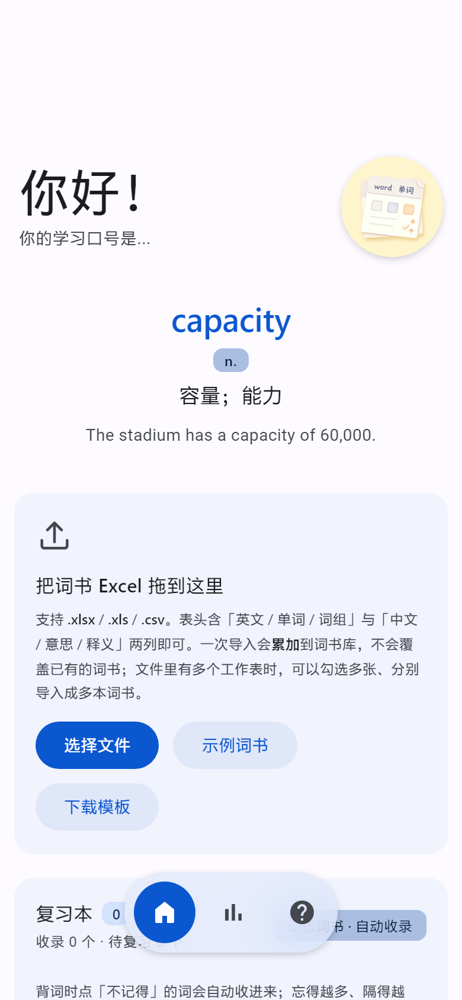
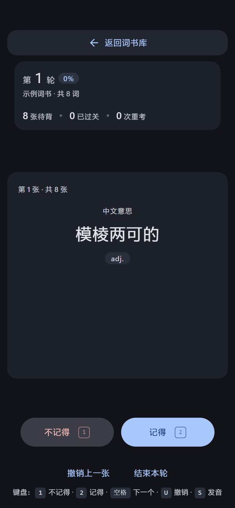
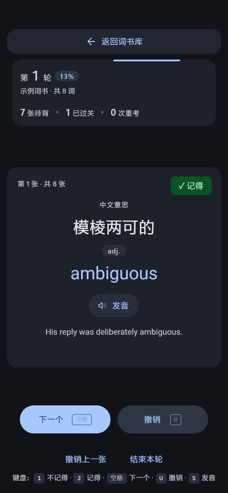
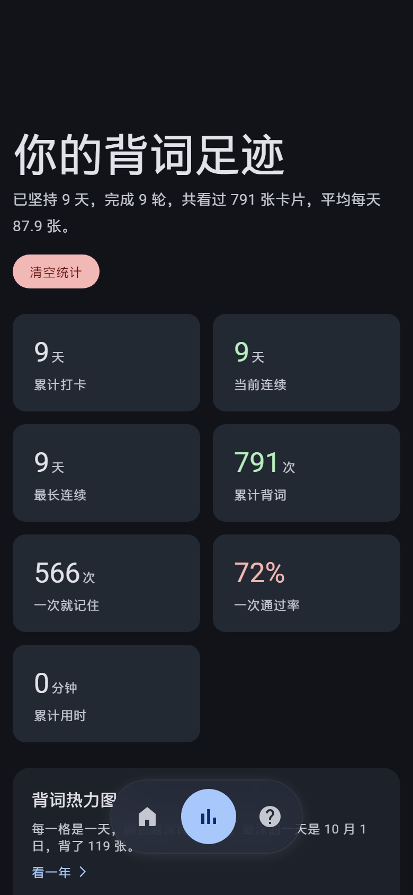
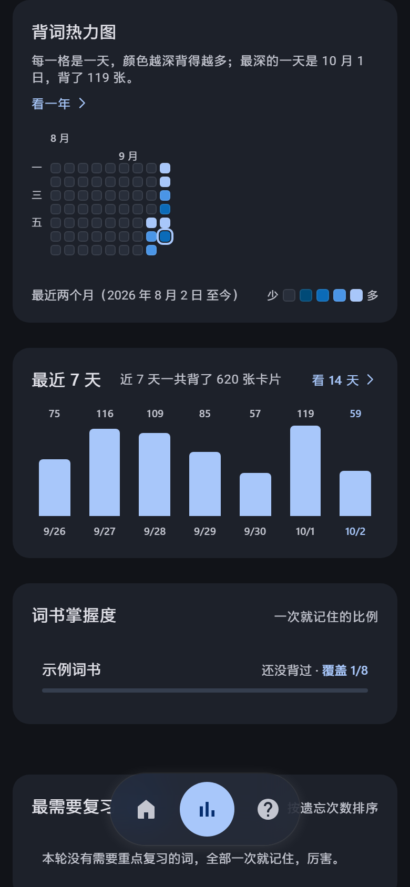
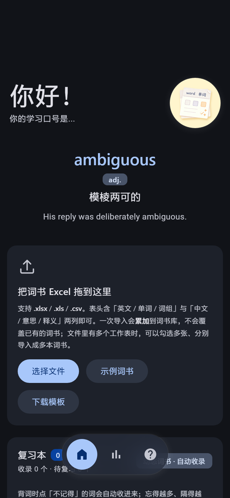

# Wordsduck2

一个**完全离线**的背单词工具：把 Excel / CSV 词表导进来，按遗忘权重抽词来背。
一份网页代码，两种用法 —— 浏览器直接打开，或者装成安卓 App。

没有账号、没有服务器、没有网络请求。词书、进度、复习本、学习统计全部存在本机
（`localStorage`），所以断网能用，也不会有人看到你在背什么。

---

## 它长什么样

| 主页 | 背词 · 提问 | 背词 · 揭示 |
|---|---|---|
|  |  |  |

| 统计 | 热力图与趋势 | 深色模式 |
|---|---|---|
|  |  |  |

- **主页**：问候语 + 随机背景词 + 拖拽导入 Excel 区 + 词书库
- **背词页**：一屏一卡，中文意思 → 想起来 → 揭示英文、词性、发音、例句
- **统计页**：连续天数 / 热力图 / 趋势 / 掌握度 / 数据备份

交互按 Material Design 3 的规范做（配色、字阶、动效时长与缓动都取 M3 的令牌），
但不引入任何前端框架 —— 就是原生 DOM + CSS，整个 `app.js` 一个 IIFE。

## 两条使用路径

### 一、浏览器（PWA，无需构建）

直接用浏览器打开 `index.html` 就能用，`file://` 也可以。

- 发音走 **Web Speech API**（音色由系统决定）
- 想用内置的 Piper 神经语音（离线、音色固定）需要额外补一份语音包，
  见 [`assets/tts/chunks/README.md`](assets/tts/chunks/README.md)

### 二、Android App

```bash
cd android
./gradlew assembleRelease
# 产物：app/build/outputs/apk/release/app-release.apk
```

已经构建好的成品见 [Releases](../../releases)。

装了 APK 之后有几处会走原生能力（网页版没有）：

| 能力 | 网页版 | APK |
|---|---|---|
| 发音 | Web Speech | 系统 TTS（`TtsBridge.kt`），不挑音色 |
| 导入表格 | `<input type="file">` | 系统文件选择器（SAF，无需存储权限） |
| 导出备份 | `<a download>` | SAF 的「另存为」（WebView 不处理 Blob 下载） |
| 换头像 | 直接读文件 | 自带 1:1 裁剪界面（`CropActivity`） |
| 返回手势 | 浏览器后退 | 分层返回 + 「再按一次退出」 |

## 目录结构

```
index.html              单页应用的骨架（四个 .screen 靠切换 class 显隐）
assets/
  app.js                全部逻辑（一个 IIFE，约 4900 行，按功能分节注释）
  style.css             全部样式（M3 令牌 + 组件 + 响应式）
  profile.js            个人资料（昵称、签名、头像）
  m3select.js           自绘下拉（原生 <select> 在移动端样式不可控）
  ripple.js             M3 涟漪
  nav-bridge.js         悬浮底栏与页面之间的桥
  tts-local.js          内置语音引擎（Piper，需要语音包）
  tts-status.js         语音状态提示
  tts/                  语音包装载器与分片目录（分片未收录）
  logo-192.png / logo-512.png
libs/
  xlsx.full.min.js      SheetJS，解析 .xlsx / .xls / .csv
android/
  BUILD-ANDROID.md      ★ 安卓壳子的完整说明（桥接协议、踩过的坑、打包与签名）
  app/src/main/java/com/wordsduck2/app/
    MainActivity.kt     入口：WebView、系统栏、文件选择、另存为、返回键
    TtsBridge.kt        页面 ↔ 系统 TTS 的桥（也寄放 setDarkMode / saveFile）
    CropActivity.kt     自实现的 1:1 头像裁剪
tools/                  开发期用的一次性脚本（CDP 验证、图标生成）
docs/screenshots/       README 里的界面截图
logo.png                源图，图标都从它生成
```

> 截图里的词书是**临时造的示例数据**（`capacity` / `significant` / `ambiguous`…），
> 不是谁的真实学习记录。

## 数据放在哪

全部在浏览器 / WebView 的 `localStorage` 里，六个键：

| 键 | 内容 |
|---|---|
| `danci.books.v2` | 词书库（含导入的表格内容、背词进度） |
| `danci.review.v1` | 复习本（答「不记得」自动收录 + 遗忘权重） |
| `danci.stats.v1` | 学习统计（每日记录、热力图用时） |
| `danci.prog.v1` | 进度版本号 |
| `danci.settings.v1` | 设置 |
| `danci.profile.v1` | 昵称 / 签名 / 头像 |

因为都在本机，**换设备或清浏览器数据之前，先去统计页「导出备份」**。

## 词表格式

第一行是表头，至少要能认出「英文」和「中文」两列：

```csv
英文,中文,词性,例句
ability,能力；本领,n.,She has the ability to solve problems quickly.
```

识别靠关键词匹配（英文 / 单词 / 词组、中文 / 意思 / 释义…），认不出来会进入
手动映射界面，让你自己选哪列是什么。`.xlsx` 里有多个工作表时可以分别导成多本词书。

## 开发期约定

- **不引入构建步骤**：网页版就是改完刷新，没有打包器、没有转译
- **CSS 只有一个文件**，按节编号组织（`1.` 令牌、`4.` 组件、`6.` 响应式…）
- `app.js` 里**关键决策都写了注释**，尤其是「为什么不用某个看起来更简单的写法」
  —— 那些都是踩过坑之后写下来的，别当成废话删掉

## 第三方

| 组件 | 许可 |
|---|---|
| [SheetJS](https://sheetjs.com/)（`libs/xlsx.full.min.js`） | Apache-2.0 |
| [Piper](https://github.com/rhasspy/piper) / onnxruntime-web（语音包） | MIT / MIT |
| Material Design 3（设计规范参照） | — |

设计参照的是 [`@material/web`](https://github.com/material-components/material-web)
（Apache-2.0）。开发时拉过一份未修改的副本放在 `设计规范/`，
**没有**收进仓库 —— 要看直接去上游。

## 许可

见 [LICENSE](LICENSE)。
